# Context 쉽고 재미있게 이해하기

---

## 들어가며
안드로이드를 개발해본 경험이 있다면 Context 에 대해서 한번쯤 들어봤을 것입니다.   
이 Context는 안드로이드 앱에서 매우 중요한 역할을 합니다.   
하지만 이 Context가 어떤 역할을 하고, 어떨 때에 쓰이는 지를 잘 모르는 경우가 많습니다.   
어떤 특성을 지녔는지 모르는 채로 사용하기도 하여, 어플리케이션의 비정상적인 동작을 일으키기도 합니다.   

저도 Context 에 대해서 잘 모르고서 개발을 이어가다가, Context 가 어떤 일을 하는지 궁금해졌습니다.   
제가 Context를 공부하며 이해한 내용을 바탕으로, 여러분들께 Context 가 무엇인지 쉽게 설명드리려 합니다.

# Context 란?

Context 란 무엇일까요?

안드로이드의 Context 를 이해하기 전에, 'context' 라는 단어의 뜻을 먼저 살펴보겠습니다.   

> context : 문맥, 맥락

context란, **문맥**, **맥락** 이라는 뜻을 가진 단어 입니다.   
**맥락**은 어떤 이야기나 대화의 주된 주제 및 흐름을 의미합니다.
나이가 어떻게 되냐고 물었는데 개발을 정말 좋아한다고 대답한다면, 좀 뜬금 없고 대화의 흐름이 어색하겠죠?
이처럼 맥락은 이야기가 자연스럽게 이어질 수 있는 중요한 요소입니다.

## 안드로이드의 Context

안드로이드에서의 **context**도 크게 다르지 않습니다. 소설 또는 영화의 이야기 흐름에 빗대어서 설명을 드리겠습니다.  

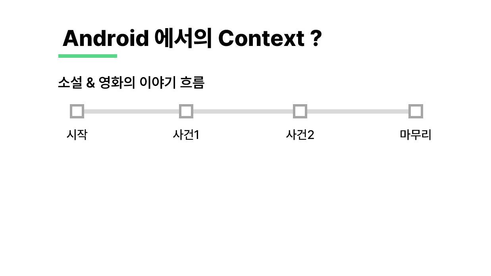
소설 또는 영화가 처음 시작하여, 크고 작은 사건들이 발생하고, 마지막에 마무리된다는 전체적인 줄거리에서의 이야기 흐름이 있습니다.
또한 하나의 사건에 대해서도, 사건이 발단되고, 점차 고조되다가, 끝내 사건이 종료되는, 작은 이야기 흐름도 존재합니다.


어플리케이션도 마찬가지입니다.
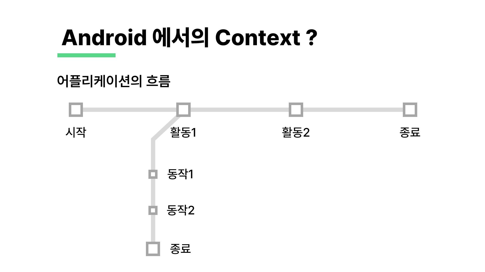

사용자는 처음 어플리케이션을 실행해서, 앱 내의 여러 서비스와 기능을 이용하고, 목적이 끝나면 앱을 종료시킵니다.  
이처럼 어플리케이션이 시작해서 서비스를 제공하고, 마지막에 종료된다는 커다란 이야기의 **'흐름'** 이 있다고 비유할 수 있습니다.


또한 하나의 화면에 대해서도 작은 이야기의 '흐름'이 존재합니다.  
로그인 화면을 상상해볼까요? 사용자는 로그인을 하기 위해서 이메일 또는 아이디, 비밀번호 등의 정보들을 입력할 수 있습니다.
자동 로그인 기능이 있다면 체크 박스가 나타날 수도 있겠죠. 사용자가 필요한 정보들을 입력하여 로그인에 성공한다면, 로그인 화면이 종료되고 새로운 화면으로 넘어갑니다.  
이렇듯 하나의 화면도 처음 시작하여 여러 View들을 보여주고, 기능을 제공하고, 목적을 달성하면 화면이 종료된다는 **'흐름'** 을 가지고 있습니다.

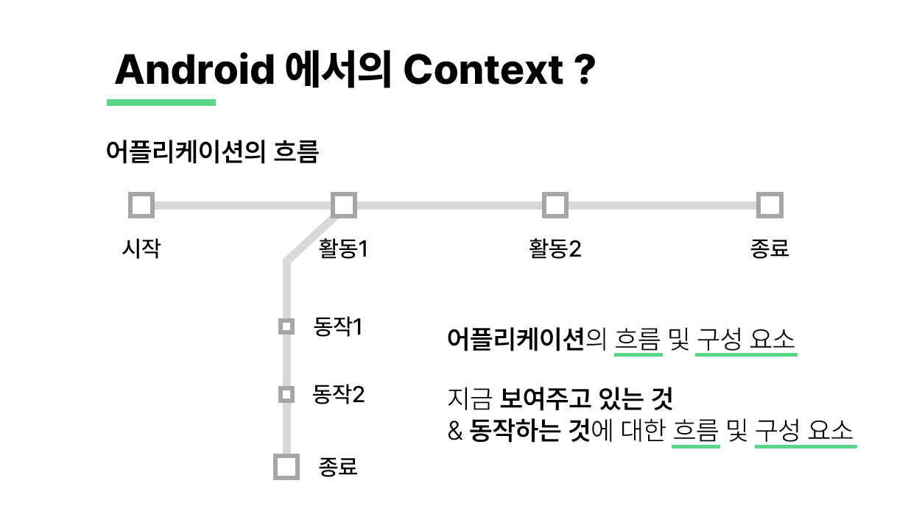
정리하자면, 안드로이드에서의 **context**는 어플리케이션의 **흐름 및 구성요소**, 현재 화면에서 보여주고 있는 것들에 대한 **흐름 및 구성요소**를 나타냅니다.  


### 안드로이드에서의 Context의 정의
**흐름** 및 **구성요소** 라는 것에 집중하면서 공식 문서의 내용을 통해 조금 더 자세하게 알아보겠습니다.

> Interface to global information about an application environment.
> This is an abstract class whose implementation is provided by the Android system.  
> It allows access to application-specific resources and classes,
> as well as up-calls for application-level operations
> such as launching activities, broadcasting and receiving intents, etc.

[안드로이드 공식 문서](https://developer.android.com/reference/kotlin/android/content/Context)에 나타나있는 설명입니다. 이를 해석하면 아래와 같습니다.

> 어플리케이션 환경에 관한 글로벌 인터페이스입니다. 추상클래스이며, 안드로이드 시스템에서 구현해줍니다.   
> Context 는 어플리케이션의 특정 리소스와 클래스에 대한 접근 뿐 아니라, 
> Activity 실행, Intent Broadcasting 과 Receiving 과 같은 상위 어플리케이션 레벨의 API 호출도 가능하게 해줍니다.

- 어플리케이션 환경에 관한 글로벌 인터페이스
- 추상 클래스로 구현되어 있으며, 안드로이드 시스템에서 구현체 제공
- 어플리케이션의 특정 리소스와 클래스에 대한 접근 가능
- 상위 어플리케이션 레벨의 API 호출 가능(Activity 실행, Intent 송수신 등)

Context 로 어플리케이션 환경에 접근하여 여러 리소스와 클래스, 기능에 접근할 수 있습니다.  
또한 화면 실행 및 전환 등 Activity 레벨에서는 할 수 없는 작업들이 존재하는데요.  
Context 를 이용해서 상위 Application 레벨의 API를 호출하여, 상위 레벨의 작업들을 수행할 수 있습니다.

요약하자면, Context 는 어플리케이션이 화면에서 나타내는 정보들과 그와 관련된 자원 및 기능들을 제공하고 관리하는 역할을 합니다.   


### Context 의 두 종류

안드로이드의 Context 는 크게 두 종류로 나뉘어집니다.   
앞서 어플리케이션을 소설이나 영화에 빗대어 표현한 걸 기억하고 계시나요?  
소설, 영화에는 전체적인 줄거리에 대한 이야기 흐름과, 하나의 사건에 대한 작은 이야기 흐름 두 가지가 존재했습니다.  
안드로이드도 마찬가지입니다. 어플리케이션이 실행, 종료되는 전체 생명주기에 관한 Context가 있습니다.  
그리고 각 화면이 시작되고 종료되는, 즉 Activity의 생명주기에 관련된 Context가 있습니다.  
이렇게 두 가지의 Context로 분류되며, 각각 Application Context 와 Activity Context 라고 합니다.

**Application Context**

Application Context 는 어플리케이션 전역에서 사용되는 Context 입니다.
[공식 문서](https://developer.android.com/reference/kotlin/android/content/Context#getapplicationcontext)에 나타나는 설명을 참고하여
Application Context 의 특징에 대해 살펴보겠습니다.  

> Return the context of the single, global Application object of the current process.  
> This generally should only be used if you need a Context whose lifecycle is separate from the current context, 
> that is tied to the lifetime of the process rather than the current component.

> 현재 프로세스의 단일 전역 Application 객체의 Context를 반환합니다.  
> 현재의 구성요소가 아닌 전체 프로세스의 수명에 연결되어 있으며,  
> 일반적으로 현재 화면 흐름과 별도의 생명주기를 가진 Context가 필요한 경우에만 사용하여야 합니다.

하나 하나씩 살펴보겠습니다.

- 단일 전역 Application 객체의 Context를 반환

Application Context가 싱글톤 인스턴스로서 존재한다는 것을 의미합니다.

- 전체 프로세스의 수명에 연결되어 있음

Application 의 생명 주기와 연결되어있다는 것을 의미하며, 앱의 시작부터 종료까지 생존합니다.

- 현재 화면 흐름과 별도의 생명 주기를 가진 Context 가 필요한 경우에만 사용

이는 Application Context 를 사용할 때의 주의점에 관한 것인데, 무척 중요한 내용이므로 잠시 뒤에 자세히 살펴보도록 하겠습니다.

<br/>

**Activity Context**

다음으로는 Activity Context 의 특징을 살펴보겠습니다.

- Activity 에서 사용되는 Context

말 그대로 Activity 에서 사용되는 Context 입니다.

- 특정 Activitiy 의 생명 주기에 종속

Activity 안에서만 사용이 가능하며, 특정 Activitiy 의 생명 주기에 종속되어 있습니다.  

- Activity 범위 안에서 사용되거나, Activity 와 같은 생명 주기를 가진 객체를 생성할 때 사용

이 역시 Activity Context 를 사용할 때의 주의점입니다. 곧 이에 대해서도 설명을 이어나가겠습니다.

## Context 올바르게 사용하기

### 두 Context 의 차이점

Context에는 Application Context와 Activity Context 두 종류가 있다는 것을 알았습니다.  
그렇다면, 둘 중에 어떤 것을 사용해야 할까요? 아무 것이나 사용해도 되는 것일까요?  
아닙니다. Context 를 잘못 사용했다가는 어플리케이션의 비정상적인 종료를 유발할 수 있으므로, 각별한 주의가 필요합니다.  

그렇다면 어떤 상황에서 어느 것을 사용해야 할까요? 이를 이해하기 위해서는 두 Context의 중요한 차이점에 대해 짚고 넘어가야 합니다.  
두 Context의 가장 큰 차이점은 바로 Lifecycle, 즉 **생명 주기**입니다.  
위에서 언급되었던 두 Context 의 사용 시 주의점을 살펴보면 각각의 생명 주기에 연관되어있는 것을 알 수 있습니다.

- Application Context : **_현재 화면 흐름과 별도의 생명 주기_** 를 가진 Context 가 필요한 경우에만 사용
- Activity Context : **_Activity 범위 안에서 사용_** 되거나, **_Activity 와 같은 생명 주기_** 를 가진 객체를 생성할 때 사용

즉, Activity 의 생명 주기에 종속되어 있느냐(Activitiy Context), 그렇지 않느냐(Application Context)에 따라 사용하는 Context 가 달라집니다.

### 아무거나 쓰면 안되는 이유 - 비유를 통해 이해하기

사실 위의 두 주의점을 보아서는, 잘못 사용하게 되었을 때 어떠한 문제점이 나타날 수 있는지를 알기 어렵습니다.  
그래서, 이번에도 간단한 비유를 들어서 쉽게 접근해보겠습니다.

**Application Context 대신 Activity Context 를 사용한다면?**

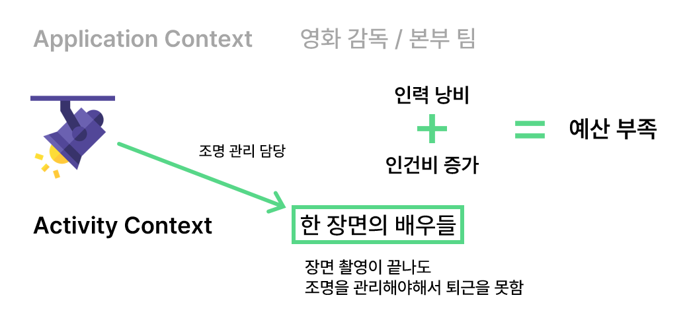
영화 촬영에 빗대어 보겠습니다.  
그리고 Application Context 를 영화 전체 줄거리와 촬영에 필요한 장비들을 잘 알고 있는 감독 및 본부 팀이라 가정하고,  
Activity Context 는 한 장면에서 배역에 따라 연기를 하는 배우들이라고 가정해보겠습니다.

촬영에 사용될 새로운 조명이 들어왔습니다. 이 조명을 관리할 인원이 필요한 상황입니다.   
일반적으로는 감독 또는 본부 팀(Application Context)에게 관리를 맡길 텐데,  
만약 배우들(Activity Context)에게 관리를 맡기게 된다면 어떻게 될까요?

배우들은 자신들의 장면 촬영이 모두 끝났는데도, 다음 장면에서도 사용될 조명을 관리해야 하기 때문에 퇴근을 할 수 없습니다.  
계속해서 퇴근하지 못하고 일을 하고 있는 배우들로 인해 인력이 낭비되고, 인건비가 증가하게 될 것입니다.  
잘못하다가는 예산이 부족하여 영화 촬영이 망할 수도 있습니다.

**메모리 누수 현상**

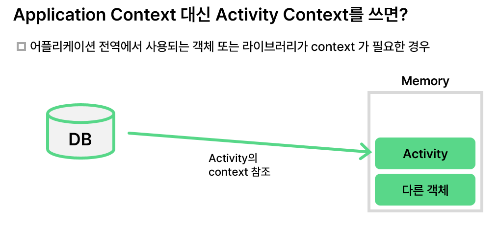
예산 부족에 포인트를 두어 더 자세히 설명드리겠습니다.  
Application Context 를 사용하는 경우는 어플리케이션 전역에서 사용되는 객체, 또는 라이브러리가 context가 필요한 경우입니다.  
DataBase 인스턴스 등을 사용할 때, Application Context가 필요합니다.  

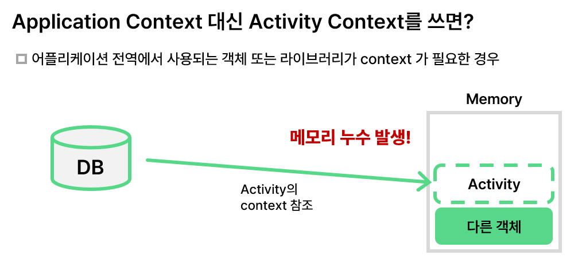
만약 DB와 같은 객체가 Application Context가 아닌 Activity Context를 사용하게 된다면, 그림과 같이 Activity Context를 참조하게 됩니다.  
그런데 이 Activity가 종료되고 더 이상 사용하지 않게 되어도, DB는 메모리 상에 여전히 남아있고 계속해서 Activity의 Context를 참조합니다.  
이 경우 메모리 공간을 관리해주는 Garbage Collector가 참조가 남아있으며 여전히 사용 중이라고 판단하게 되고, 사용하지 않는 Activity를 메모리에서 지울 수 없게 됩니다. 

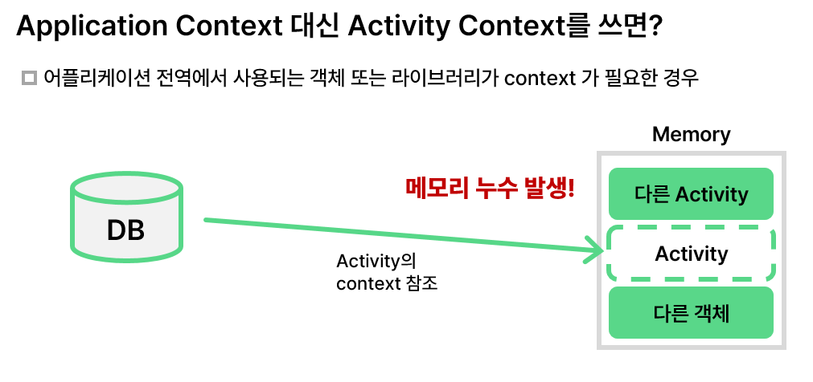
이렇듯 객체에 대한 참조가 남아있어 메모리에서 지울 수 없게 되어 객체가 메모리 공간을 차지하고 있는 것을 메모리 누수 현상이라고 부릅니다.  
Activity에 의해 메모리 누수가 발생한 상황에서, 다른 Activity가 실행되거나 다른 객체가 인스턴스화 되어 메모리에 올라간다면 메모리 공간이 부족해지고,
잘못하면 서비스가 비정상적으로 종료될 수 있습니다.

> Activity Context 라는 배우가 계속 남아서 일을 하게 되면서 인건비가 증가하고, 결국에는 메모리라는 예산이 부족해질 수 있습니다.

**Activity Context 대신 Application Context 를 사용한다면?**

메모리 누수 현상을 피하기 위해서 Application Context 만을 사용해도 되지 않을까요? 
그렇지 않습니다. 이 역시도 영화 촬영에 비유해서 설명해보겠습니다.

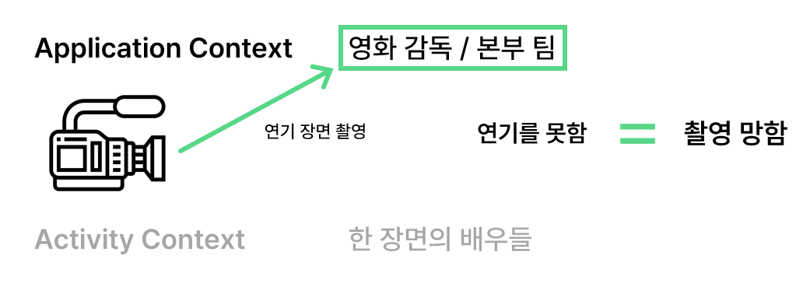
영화 촬영이 시작되었습니다.  
연기를 하는 배우들을(Activity Context) 촬영해야 하는데, 만약 감독과 본부 팀(Application Context)을 촬영한다면 어떻게 될까요?  
이 사람들은 배우들보다 연기를 못하기 때문에, 촬영에 어려움을 겪게 될 수 있습니다.  

이렇듯 Application Context 만을 사용하게 된다면 촬영, 즉 보여주는 것에 문제가 발생할 수 있습니다.

Activity Context 를 사용해야하는 상황은 Activity 와 같은 생명 주기를 가진 객체가 Context를 필요로 하는 경우,   
그리고 View와 관련된 UI 작업에 Context가 필요한 경우입니다.  

Context를 통해 여러 가지 리소스를 얻어올 수 있는데, 그 중 하나는 Theme 입니다.
Context는 xml에서 설정한 Theme, 즉 테마에 대한 정보도 가지고 있습니다.
그런데 Activity Context 대신 Application Context 를 사용하게 된다면, Activity에서 사용되는 테마가 아닌 Application의 테마가 적용될 수 있습니다.   
Application의 테마는 어플리케이션이 처음 실행되어 설정된 기본 테마를 의미합니다.
한 화면에 맞추어 디자인된 테마가 아니라 기본 테마가 설정된다면 UI 출력에 문제가 발생할 수 있습니다.

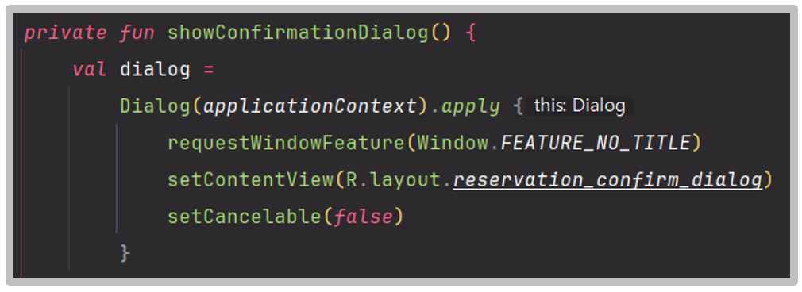
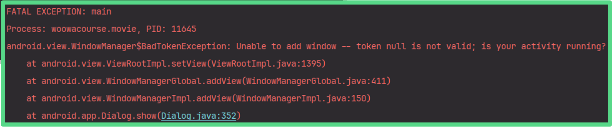
또한 View를 그릴 때에 필요한 요소들 중 일부를 지원하지 않습니다. 대표적으로 Activity의 윈도우에 대한 접근이 불가능한데요.   
만약 다이얼로그를 띄울 때 Activity Context 가 아닌 Application Context 를 넘겨주게 된다면,  
다이얼로그 출력 시 Window 접근에 관련된 에러가 발생하며 어플리케이션이 강제 종료됩니다.   


# Context 의 사용법

## Context 사용의 기준

이렇듯 다양한 리소스와 기능들을 제공해주고 여러 방면에서 활용되는 Context이지만, 잘못 사용하게 될 경우에는 치명적일 수 있습니다.  
그렇다면 이 Context를 어떻게 적절하게 사용해야 할까요?   
명확한 기준이 있다면 좋겠지만, 상황과 개발 환경에 따라서 달라질 수 있기 때문에 확실한 기준을 세우기 어렵습니다.

### Lifecycle 을 기준으로!

그래도 저희는 확실하지 않지만, 어림 짐작으로 힌트를 얻을 수 있습니다. 바로 생명 주기입니다. 

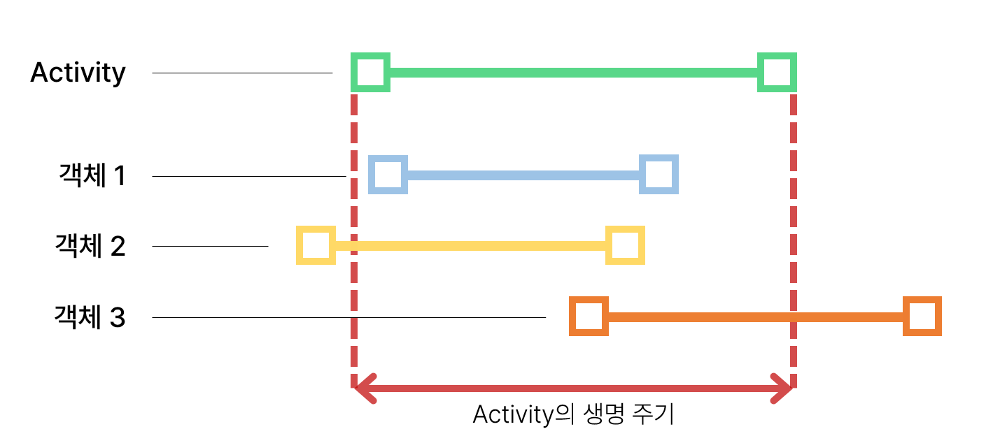
Context를 넘겨받는다는 것은 결국 Context 를 넘겨주는 객체, 즉 Activity 또는 Application의 생명 주기에 종속된다는 것을 의미합니다. 

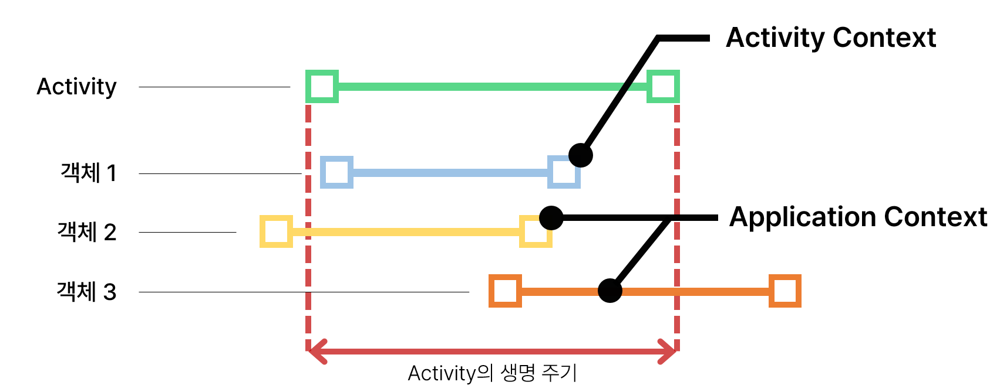
그러므로 Context 를 받는 객체들의 생명주기가 얼마나 긴 지를 파악한다면, 어떤 Context 를 넘겨주어야 할 지 힌트를 잡을 수 있습니다.


또한, View 에 관련된 UI 작업의 경우는 Activity Context 를 사용하는 것이 바람직합니다.  


UI 작업은 여러 View나 Fragment 등 Activity 내부에서 이루어집니다.   


결국 View 에 관련된 작업은 Activity 의 생명주기에 종속된다는 의미이므로, Activity Context 를 넘겨주는 것입니다.   


## Context 사용 예시

지금까지 Context 의 개념과 특성에 대해 비유를 통해 알아보았고, 사용 시에 어떤 주의점이 있는지도 알아보았습니다.  
그렇다면 이 Context 를 구체적으로 어떤 상황에서 사용할 수 있는지를 살펴보겠습니다.

### Context 가 필요한 다양한 상황

안드로이드에서 Context 를 사용하여 앱의 다양한 요소들에 접근할 수 있는데요.   
주로 아래와 같은 상황에서 사용할 수 있습니다. 사용 예시 코드와 함께 첨부했습니다.

1. **리소스 접근**
   - 문자열 리소스 접근: 앱에서 제공하는 문자열 리소스에 접근하여 화면에 텍스트를 출력할 때 사용할 수 있습니다.
      ```xml
      <resources>
         <string name="app_name">MyApplication</string>
         <string name="format_date">%1$d.%2$d.%3$d</string>
      </resources>
      ```
      ```kotlin
      // 문자열 리소스로부터 application 의 이름을 가져옵니다.
      val appName = context.getString(R.string.app_name)
      // 문자열 리소스에 작성된 포맷 문자열을 가지고 와 동적으로 값을 넣을 수 있습니다.
      val formattedDate = context.getString(R.string.format_date, 2024, 10, 1)
      ```
   - 색상 및 drawable 접근: 어플리케이션에 정의된 색상이나, 이미지, icon 등의 drawable 을 가져올 때 사용됩니다.
      ```kotlin
      // 색상을 가져옵니다.
      val color = ContextCompat.getColor(context, R.color.primary_color)
      // drawable 의 icon 또는 이미지를 가지고 올 수 있습니다.
      val closeIcon = ContextCompat.getDrawable(context, R.drawable.icon_close)
      val backgroundImage = ContextCompat.getDrawable(context, R.drawable.image_background)
      ```
     ContextCompat 은 안드로이드 하위 버전과의 호환을 위해서 사용되는 Context 입니다.   
     일반적인 Context 처럼 사용할 수 있으며, 첫번째 인자로 context를 넘겨줍니다.


2. **View 가져오기 및 생성**
   - 코드에서 xml 레이아웃에 정의된 View를 가져오거나, 동적으로 View 객체를 생성해야 할 때 사용합니다.
      ```kotlin
      // activity_main.xml에서 정의된 TextView를 가져옵니다.
      val textView: TextView = findViewById(R.id.my_text_view)
      textView.text = "Hello, World!"
      
      // 또는 동적으로 View를 생성할 때 사용할 수 있습니다.
      val button = Button(context).apply {
            text = "Click Me"
            layoutParams = LinearLayout.LayoutParams(
                LinearLayout.LayoutParams.WRAP_CONTENT,
                LinearLayout.LayoutParams.WRAP_CONTENT
            )
        }
      ```


3. **시스템 서비스 접근**
   - 앱에서 위치 서비스, 알림 서비스, 인터넷 연결 상태 등 시스템에 접근해야할 때 사용합니다.
      ```kotlin
      // 시스템으로부터 SW 키보드를 관리하는 Manager를 가져옵니다.
      val inputMethodManager = getSystemService(INPUT_METHOD_SERVICE) as InputMethodManager
      // 위치 서비스를 가져옵니다.
      val locationManager = context.getSystemService(Context.LOCATION_SERVICE) as LocationManager
      ```


4. **Application, Activity, Fragment 간의 데이터 공유**
   - 특정 Activity, 또는 Fragment에서 다른 Component로 데이터를 전달할 때 사용됩니다. Intent 를 함께 사용합니다.
      ```kotlin
      // Intent를 사용하여 다른 Activity를 실행할 때 사용됩니다.
      val intent = Intent(context, AnotherActivity::class.java)
      context.startActivity(intent)
      ```
     

5. **파일 접근 및 저장**
   - 어플리케이션 내부 또는 외부 파일 디렉터리에 파일을 저장하거나 불러올 때 사용합니다.
      ```kotlin
      // getFilesDir, getExternalFilesDir 같은 메서드로 파일 경로를 얻습니다.
      val file = File(context.filesDir, "file.txt")
      ```


6. **SharedPreferences 접근**
   - 간단한 설정 값을 저장하거나 불러올 수 있는 SharedPreference에 접근할 때에도 Context가 필요합니다.
      ```kotlin
      // Context를 통해 SharedPreference에 접근하여 사용할 수 있습니다.
      val sharedPreferences = context.getSharedPreferences("my_prefs", Context.MODE_PRIVATE)
      val editor = sharedPreferences.edit()
      editor.putString("key", "value").apply()
      ```


7. **다이얼로그, 또는 토스트를 표시**
   - 화면에 다이얼로그나 토스트를 띄워서, 사용자에게 원하는 메시지를 보여주고 싶을 때 사용합니다.
      ```kotlin
      // Activity, 또는 Fragment에서 토스트를 띄울 때, Context를 사용합니다.
      Toast.makeText(context, "Hello!", Toast.LENGTH_SHORT).show()
      ```

## 결론
이렇듯 Context는 안드로이드 앱에서 중요한 요소들을 관리하고 접근할 수 있는, 매우 필수적인 객체입니다.   
이러한 Context의 개념을 잘 이해하고, 사용 시 주의점을 잘 지켜내어 올바르게 접근하는 것이 중요합니다.   

